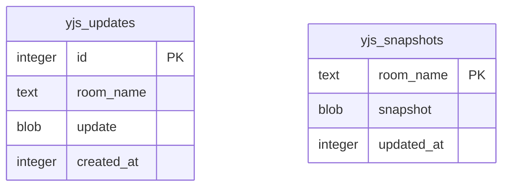

# feat: Add Nuxt 4 Collaborative Todo Example with Drizzle SQLite Persistence

## Overview

Add a full-stack Nuxt 4 example app to the monorepo that demonstrates real-time multi-user collaboration using Yjs. The app is a **collaborative todo list** with drag-to-reorder via fractional indexing, WebSocket synchronization through a custom Nitro handler, SQLite persistence via Drizzle ORM, and multi-client awareness (presence indicators). This example showcases the full power of the `vue-yjs` composables library (`useY`, `useYDoc`, `useAwareness`, `useUndoManager`, `useWebSocketProvider`) in a production-like server-rendered context.

Inspired by the [Learn Yjs Todo List lesson](https://learn.yjs.dev/lessons/03-todo-list/), this example implements the recommended "better data model" with fractional indexing to avoid the distributed gotchas of array-based reordering.

## Problem Statement / Motivation

The existing example app (`examples/app/`) is a client-only Vue 3 SPA with no networking -- it demonstrates the composables but not real collaboration. There is no example showing:

- **Server-side Yjs synchronization** via the `useWebSocketProvider` composable
- **Multi-client awareness** via the `useAwareness` composable
- **Persistence** -- todos vanish when the page reloads
- **SSR considerations** -- how to use Yjs (a client-only library) in a server-rendered framework
- **Conflict-safe reordering** -- the SPA example uses naive array indexing for todo order

A Nuxt 4 example with Nitro WebSockets and Drizzle SQLite fills all these gaps and serves as a reference implementation for anyone building collaborative Vue apps with `vue-yjs`.

## Proposed Solution

Add `examples/nuxt-app/` to the monorepo -- a Nuxt 4 app with:

1. **Nitro WebSocket handler** implementing the `y-protocols/sync` and `y-protocols/awareness` binary protocols
2. **Drizzle ORM + SQLite** for persisting Yjs document updates (batched writes with compaction)
3. **Fractional indexing** via the `fractional-indexing` npm package for conflict-safe drag-to-reorder
4. **vue-draggable-plus** for the drag-and-drop UI
5. **All five vue-yjs composables** in action

## Technical Approach

### Architecture

```
Browser (Client)                          Nitro Server
────────────────                          ────────────
app/pages/index.vue                       server/routes/_ws.ts
  <ClientOnly>                              defineWebSocketHandler
    <TodoApp />                               - parse message type byte
                                              - messageSync (0): y-protocols/sync
app/composables/                              - messageAwareness (1): broadcast
  useTodoList.ts                              - room management (in-memory Y.Doc per room)
    - useYDoc()                               - peer tracking
    - useWebSocketProvider()
    - useAwareness()                      server/utils/
    - useUndoManager()                      yjs-persistence.ts
    - useY()                                  - batched writes
    - fractional indexing logic               - compaction (merge updates into snapshot)
                                              - load persisted doc on room init
app/components/
  TodoItem.vue                            server/database/
  PresenceBar.vue                           schema.ts (Drizzle schema)
  ConnectionStatus.vue                      migrations/ (Drizzle Kit)

                                          server/utils/
                   ◄── y-protocols/sync ──►  db.ts (Drizzle + better-sqlite3)
                   ◄── y-protocols/awareness ──►
                   (binary WebSocket frames)
```

### Data Model

**Yjs Document Structure:**
```
Y.Doc
  └── Y.Array<Y.Map> "todos"
        ├── Y.Map { id: string, text: string, done: boolean, sortKey: string }
        ├── Y.Map { id: string, text: string, done: boolean, sortKey: string }
        └── ...
```

- `id`: UUID v4 via `crypto.randomUUID()` -- stable key for Vue `v-for` and ID-based lookups
- `text`: todo content string
- `done`: boolean toggle
- `sortKey`: lexicographic string from `fractional-indexing` package (`generateKeyBetween`)

**Display order** is always determined by sorting on `sortKey`, never by Y.Array index. The Y.Array serves as a container; its internal ordering is irrelevant.

**Deletion** uses ID-based lookup (iterate Y.Array to find item by `id`), not index-based, to avoid race conditions with concurrent edits.

**SQLite Schema (Drizzle):**

```typescript
// server/database/schema.ts
import { sqliteTable, text, blob, integer } from 'drizzle-orm/sqlite-core'

export const yjsUpdates = sqliteTable('yjs_updates', {
  id: integer('id').primaryKey({ autoIncrement: true }),
  roomName: text('room_name').notNull(),
  update: blob('update', { mode: 'buffer' }).notNull(),
  createdAt: integer('created_at', { mode: 'timestamp' })
    .notNull()
    .$defaultFn(() => new Date()),
})

export const yjsSnapshots = sqliteTable('yjs_snapshots', {
  roomName: text('room_name').primaryKey(),
  snapshot: blob('snapshot', { mode: 'buffer' }).notNull(),
  updatedAt: integer('updated_at', { mode: 'timestamp' })
    .notNull()
    .$defaultFn(() => new Date()),
})
```



### Fractional Indexing Strategy

Uses the `fractional-indexing` npm package (by Rocicorp) for lexicographic string keys:

- **Add at end**: `generateKeyBetween(lastItem.sortKey, null)`
- **Add at beginning**: `generateKeyBetween(null, firstItem.sortKey)`
- **Move between items**: `generateKeyBetween(prevItem.sortKey, nextItem.sortKey)`
- **Tie-breaking for concurrent edits**: When two users compute the same sortKey (same gap), Yjs's Y.Map `set` is last-writer-wins per field. Since each user moves a **different item**, there is no conflict. If two users move the **same item** simultaneously, LWW picks one -- acceptable UX. As a secondary tiebreaker in display, sort by `id` when sortKeys are equal.

This avoids the floating-point precision issues described in the Learn Yjs tutorial by using arbitrary-length string keys instead of numeric fractions.

### SSR Boundary

Yjs cannot run during SSR. The boundary is defined clearly:

- **`app/pages/index.vue`**: Server-renders the page shell (header, layout) and wraps the collaborative content in `<ClientOnly>` with a skeleton fallback
- **`app/composables/useTodoList.ts`**: Only called within `<ClientOnly>` scope, so all Yjs imports are client-side only
- **No Yjs imports at the top level of any server-rendered component**

```vue
<!-- app/pages/index.vue -->
<template>
  <div>
    <h1>Collaborative Todos</h1>
    <ClientOnly>
      <TodoApp />
      <template #fallback>
        <TodoSkeleton />
      </template>
    </ClientOnly>
  </div>
</template>
```

### WebSocket Protocol Implementation

The Nitro handler at `server/routes/_ws.ts` implements the full y-protocols binary protocol:

1. **Message framing**: First byte is message type (`0` = sync, `1` = awareness)
2. **Sync protocol**: Uses `y-protocols/sync` functions (`readSyncMessage`, `writeSyncStep1`, `writeSyncStep2`, `writeUpdate`)
3. **Awareness protocol**: Uses `y-protocols/awareness` for encoding/decoding awareness state; server broadcasts to all peers in the room except the sender
4. **Room management**: In-memory `Map<string, Room>` where each Room holds a `Y.Doc`, `Awareness`, and `Set<Peer>`
5. **Binary frames**: crossws `message.rawData` provides access to `ArrayBuffer`; responses sent as `Uint8Array`

**Client-side**: Uses `y-websocket`'s `WebsocketProvider` via the `useWebSocketProvider` composable -- it speaks the same binary protocol, so no custom client code is needed.

**Room URL convention**: The `WebsocketProvider` appends the room name to the URL path: `ws://host/_ws/my-room`. The Nitro handler parses the room name from the URL path.

### Persistence Strategy

**Batched writes**: Updates are accumulated in memory for 500ms, then merged via `Y.mergeUpdates()` and written as a single row to `yjs_updates`.

**Compaction**: After 100 incremental updates for a room, all updates + the existing snapshot are merged into a single snapshot row in `yjs_snapshots`, and the incremental updates are deleted. Uses a SQLite transaction to prevent the race condition where a new update arrives mid-compaction:

```sql
BEGIN TRANSACTION;
-- Read all update IDs up to a known max ID
-- Merge and write snapshot
-- DELETE only updates with id <= max_id (not "all updates for room")
COMMIT;
```

**Room lifecycle**:
- Created on first peer connection; loads persisted state from DB
- Destroyed 30 seconds after last peer disconnects (grace period for reconnections); persists full doc state before cleanup

### Awareness & Presence

**State shape**:
```typescript
interface AwarenessState {
  name: string   // user-entered or generated
  color: string  // from a predefined palette
}
```

- **Name**: Generated as "User {random 4-digit number}" on first visit, stored in `localStorage`. User can edit it inline.
- **Color**: Assigned from a palette of 8 distinct colors based on `clientId % 8`. Stored in `localStorage`.
- **Display**: A horizontal bar above the todo list showing colored dots/avatars for each connected user.
- **Timeout**: Default 30-second awareness timeout from `y-protocols` (acceptable for a demo).
- **No cursor/selection tracking** -- just connected user indicators. Keeps scope reasonable.

### Implementation Phases

#### Phase 1: Nuxt 4 App Scaffold & Monorepo Integration

**Tasks:**
- [ ] Create `examples/nuxt-app/` with `npx nuxi@latest init` using Nuxt 4
- [ ] Configure `package.json`: name `vue-yjs-example-nuxt-app`, `"private": true`
- [ ] Add `"vue-yjs": "workspace:*"` dependency, plus `yjs`, `y-websocket`, `y-protocols` peer deps
- [ ] Add `tsconfig.json` path alias: `"vue-yjs": ["../../packages/vue-yjs/src"]`
- [ ] Add package name to `.changeset/config.json` `"ignore"` array
- [ ] Configure `nuxt.config.ts`: enable `nitro.experimental.websocket`
- [ ] Create `app/app.vue` with basic layout
- [ ] Create `app/pages/index.vue` with `<ClientOnly>` wrapper
- [ ] Verify `pnpm install` resolves workspace dependencies
- [ ] Verify `pnpm dev --filter vue-yjs-example-nuxt-app` starts without errors

**Files:**
- `examples/nuxt-app/package.json`
- `examples/nuxt-app/nuxt.config.ts`
- `examples/nuxt-app/tsconfig.json`
- `examples/nuxt-app/app/app.vue`
- `examples/nuxt-app/app/pages/index.vue`
- `.changeset/config.json` (update `ignore` array)

**Success criteria:**
- Nuxt dev server starts, renders a page with "Collaborative Todos" heading
- `<ClientOnly>` wrapper shows fallback skeleton during SSR

#### Phase 2: Drizzle SQLite Setup & Database Schema

**Tasks:**
- [ ] Install `drizzle-orm`, `better-sqlite3`, `drizzle-kit`, `@types/better-sqlite3`
- [ ] Create `server/database/schema.ts` with `yjs_updates` and `yjs_snapshots` tables
- [ ] Create `server/utils/db.ts` with Drizzle + better-sqlite3 init (WAL mode)
- [ ] Create `drizzle.config.ts` at example root
- [ ] Add `data/` directory to `.gitignore` (SQLite files)
- [ ] Add `db:generate` and `db:push` scripts to `package.json`
- [ ] Run `drizzle-kit push` to create initial schema

**Files:**
- `examples/nuxt-app/server/database/schema.ts`
- `examples/nuxt-app/server/utils/db.ts`
- `examples/nuxt-app/drizzle.config.ts`
- `examples/nuxt-app/.gitignore`

**Success criteria:**
- `pnpm db:push` creates `data/collab.db` with correct tables
- `drizzle-kit studio` shows the schema

#### Phase 3: Nitro WebSocket Handler (y-protocols Sync Server)

**Tasks:**
- [ ] Install `y-protocols`, `lib0` as server dependencies (already peer deps of vue-yjs, but needed server-side)
- [ ] Create `server/utils/yjs-persistence.ts` with `persistUpdate`, `loadPersistedDoc`, `persistFullDoc`, and compaction logic
- [ ] Create `server/routes/_ws.ts` with `defineWebSocketHandler` implementing:
  - Room management (in-memory Map of rooms)
  - Binary message parsing (sync type `0`, awareness type `1`)
  - `y-protocols/sync` message handling (`readSyncMessage`, `writeSyncStep1`)
  - Awareness message broadcasting
  - `doc.on('update')` listener for persistence and peer broadcasting
  - `awareness.on('update')` listener for awareness broadcasting
  - Room cleanup on last peer disconnect (30s grace period)
- [ ] Verify binary WebSocket frame handling with crossws

**Files:**
- `examples/nuxt-app/server/routes/_ws.ts`
- `examples/nuxt-app/server/utils/yjs-persistence.ts`

**Success criteria:**
- A simple test client can connect, send a SyncStep1, receive SyncStep2
- Updates are persisted to SQLite
- Server restart loads persisted state
- Multiple clients in the same room receive each other's updates

#### Phase 4: Client-Side Todo Composable & UI

**Tasks:**
- [ ] Install `fractional-indexing`, `vue-draggable-plus`
- [ ] Create `app/composables/useTodoList.ts`:
  - Calls `useYDoc()` to get the injected doc
  - Gets `Y.Array<Y.Map>` from doc with key `"todos"`
  - Uses `useY()` for reactive snapshot, sorted by `sortKey`
  - Implements `addTodo(text)`, `toggleTodo(id)`, `deleteTodo(id)`, `moveTodo(fromIndex, toIndex)`, `editTodo(id, text)`
  - `moveTodo` uses `generateKeyBetween` for fractional indexing
  - `deleteTodo` uses ID-based lookup (iterate array to find by id)
  - `addTodo` generates UUID, assigns sortKey via `generateKeyBetween(lastSortKey, null)`
- [ ] Create `app/composables/useCollaboration.ts`:
  - Calls `useProvideYDoc()` to create and provide the doc
  - Calls `useWebSocketProvider()` to connect to `/_ws` with room name
  - Calls `useAwareness()` for presence
  - Calls `useUndoManager()` scoped to the todos Y.Array
  - Sets initial awareness state (name, color from localStorage)
  - Returns all reactive state needed by components
- [ ] Create `app/components/TodoApp.vue`:
  - Root client-only component
  - Calls `useCollaboration()` and `useTodoList()`
  - Renders `PresenceBar`, `ConnectionStatus`, `TodoInput`, todo list, undo/redo buttons
- [ ] Create `app/components/TodoItem.vue`:
  - Single todo row: checkbox, text (editable), delete button, drag handle
  - Emits events for toggle, delete, edit
- [ ] Create `app/components/TodoInput.vue`:
  - Input field + submit button for adding new todos
  - Clears on submit, prevents empty submissions
- [ ] Create `app/components/PresenceBar.vue`:
  - Shows colored dots/names for each connected user
  - Highlights "You" with a label
- [ ] Create `app/components/ConnectionStatus.vue`:
  - Small indicator showing connection status (connected/connecting/disconnected)
  - Shows "Synced" badge when fully synced
- [ ] Create `app/components/TodoSkeleton.vue`:
  - Loading skeleton shown during SSR/before hydration
- [ ] Integrate `vue-draggable-plus` `VueDraggable` component for drag-to-reorder
  - Map SortableJS `onUpdate` event to `moveTodo(oldIndex, newIndex)` using sorted display indices
- [ ] Wire up undo/redo: Ctrl+Z / Cmd+Z for undo, Ctrl+Y / Cmd+Shift+Z for redo
  - Detect platform for correct keybindings

**Files:**
- `examples/nuxt-app/app/composables/useTodoList.ts`
- `examples/nuxt-app/app/composables/useCollaboration.ts`
- `examples/nuxt-app/app/components/TodoApp.vue`
- `examples/nuxt-app/app/components/TodoItem.vue`
- `examples/nuxt-app/app/components/TodoInput.vue`
- `examples/nuxt-app/app/components/PresenceBar.vue`
- `examples/nuxt-app/app/components/ConnectionStatus.vue`
- `examples/nuxt-app/app/components/TodoSkeleton.vue`

**Success criteria:**
- Single client can add, toggle, delete, reorder, and edit todos
- Todos persist across page reloads (via WebSocket sync from server-persisted state)
- Undo/redo works for all operations
- Presence bar shows the current user

#### Phase 5: Multi-Client Collaboration & Polish

**Tasks:**
- [ ] Open two browser tabs/windows and verify:
  - Both see the same todo list
  - Adding a todo on one appears on the other in real-time
  - Toggling done syncs instantly
  - Drag-to-reorder syncs correctly (both clients show same order)
  - Deleting a todo removes it from both clients
  - Undo on one client only undoes that client's actions
  - Presence bar shows both users with distinct colors
- [ ] Handle edge cases:
  - Concurrent drag of the same item by two users (LWW on sortKey)
  - Concurrent drag to the same position (different items get different sortKeys because each sets its own item's sortKey)
  - Delete while another user is dragging (item disappears from drag preview)
  - Add while another user is mid-drag (list updates without disrupting drag)
  - Server restart while clients are connected (reconnect, re-sync from DB)
- [ ] Add basic styling:
  - Clean, minimal CSS (no framework -- raw CSS or Nuxt's built-in CSS support)
  - Todo items with checkbox, text, drag handle icon, delete button
  - Completed todos with strikethrough text
  - Presence dots with user color
  - Connection status indicator (green dot = connected, yellow = connecting, red = disconnected)
  - Responsive layout for mobile
- [ ] Handle error states:
  - Show "Connecting..." with spinner when WebSocket is connecting
  - Show "Reconnecting..." when disconnected (y-websocket auto-reconnects)
  - Empty state: "No todos yet. Add one above!" message

**Success criteria:**
- Multi-client collaboration works correctly with all CRUD + reorder operations
- Visual feedback for connection state
- Concurrent edits resolve cleanly without duplicates or lost items
- Mobile-friendly drag (touch events via SortableJS)

#### Phase 6: Monorepo Integration & CI

**Tasks:**
- [ ] Update root `package.json` build scripts to include the Nuxt example:
  - Add `"build:nuxt-app": "pnpm --filter vue-yjs-example-nuxt-app build"`
  - Update `"build"` script to include Nuxt app (run after library build)
- [ ] Update root `package.json` test scripts if Nuxt example has tests
- [ ] Verify `pnpm test` from root still passes (vitest workspace picks up new example)
- [ ] Verify `pnpm lint:check` passes for new files (oxlint with vue plugin)
  - Address any false positives from Nuxt auto-imports (may need `.oxlintrc.json` updates for the examples directory)
- [ ] Update CI workflow `.github/workflows/test-and-checks.yml` if needed
- [ ] Add a `README.md` to `examples/nuxt-app/` with:
  - What the example demonstrates
  - How to run it (`pnpm dev`)
  - How to open multiple browser windows to test collaboration
  - Architecture overview

**Files:**
- `package.json` (root -- update build scripts)
- `.github/workflows/test-and-checks.yml` (if needed)
- `examples/nuxt-app/README.md`

**Success criteria:**
- `pnpm build` from root builds library then both examples
- `pnpm test` from root runs all tests
- `pnpm lint:check` passes
- CI pipeline passes

## Alternative Approaches Considered

### 1. Use y-websocket's built-in Node.js server instead of Nitro handler
**Rejected.** Running a separate WebSocket server alongside Nuxt defeats the purpose of Nitro's integrated server. The custom handler demonstrates how to embed Yjs sync directly in the application server, which is more practical for production deployments.

### 2. Use y-sweet (Jamsocket's hosted Yjs server) instead of custom persistence
**Rejected.** While y-sweet simplifies deployment, it adds an external dependency and doesn't demonstrate the Drizzle/SQLite integration. The goal is to show a fully self-contained example.

### 3. Use numeric fractional indices (as in the Learn Yjs tutorial) instead of string-based
**Rejected.** Floating-point precision degrades after ~50 averaging operations. The `fractional-indexing` package uses arbitrary-length string keys that never lose precision. The tutorial itself recommends "a real implementation should use arbitrary-precision decimals."

### 4. Use Y.Map (keyed by todo ID) instead of Y.Array for the todo collection
**Considered but deferred.** A `Y.Map<Y.Map>` keyed by ID would avoid index-based deletion issues entirely. However, `Y.Array` is used in the existing SPA example and in the Learn Yjs tutorial, making it the more recognizable pattern. The ID-based deletion strategy (iterating to find by ID) mitigates the index race condition.

### 5. Use Nuxt 3 instead of Nuxt 4
**Rejected.** Nuxt 4 is the current version (2026) and uses the `app/` directory convention. Using Nuxt 3 would make the example outdated on arrival.

## Acceptance Criteria

### Functional Requirements

- [ ] Nuxt 4 app starts with `pnpm dev` and renders the todo list page
- [ ] SSR renders a skeleton/loading state; Yjs initializes only on the client
- [ ] WebSocket connects to the Nitro handler and syncs the Yjs document
- [ ] Users can add, edit, toggle, delete, and drag-to-reorder todos
- [ ] Changes sync in real-time between multiple browser tabs/windows
- [ ] Todos persist across page reloads and server restarts (SQLite)
- [ ] Undo/redo works for local changes (Ctrl/Cmd+Z, Ctrl/Cmd+Y)
- [ ] Presence bar shows all connected users with distinct colors
- [ ] Connection status indicator shows connected/connecting/disconnected state
- [ ] Drag-to-reorder uses fractional indexing (no item duplication on concurrent reorders)

### Non-Functional Requirements

- [ ] No hydration mismatch warnings in console
- [ ] No Yjs imports execute during SSR
- [ ] SQLite uses WAL mode for concurrent read/write performance
- [ ] Batched persistence writes (not one DB write per Yjs update)
- [ ] Compaction prevents unbounded growth of the updates table
- [ ] TypeScript strict mode with no type errors
- [ ] Passes oxlint checks

### Quality Gates

- [ ] `pnpm build` from root succeeds (library + both examples)
- [ ] `pnpm lint:check` passes
- [ ] Manual multi-client testing passes (2+ tabs with concurrent edits)
- [ ] Server restart preserves all data
- [ ] No console errors during normal operation

## Dependencies & Prerequisites

- **vue-yjs library** must be built first (already handled by root build script ordering)
- **pnpm workspaces** must resolve `workspace:*` for the vue-yjs dependency
- **Node.js** with native `crypto.randomUUID()` support (Node 19+)
- **better-sqlite3** requires native compilation (node-gyp) -- this is standard for SQLite in Node.js

### npm Dependencies for the Nuxt Example

| Package | Purpose | Version |
|---------|---------|---------|
| `vue-yjs` | Composables library (workspace) | `workspace:*` |
| `yjs` | CRDT runtime | `^13.6.16` |
| `y-websocket` | WebSocket provider | `^2.0.4` |
| `y-protocols` | Sync & awareness protocols | `^1.0.6` |
| `lib0` | Binary encoding/decoding | `^0.2.0` |
| `drizzle-orm` | ORM for SQLite | `latest` |
| `better-sqlite3` | SQLite driver | `latest` |
| `fractional-indexing` | Lexicographic sort keys | `^3.2.0` |
| `vue-draggable-plus` | Drag-and-drop (SortableJS wrapper) | `latest` |

**Dev dependencies:**
| Package | Purpose |
|---------|---------|
| `drizzle-kit` | Schema migrations |
| `@types/better-sqlite3` | TypeScript types |

## Risk Analysis & Mitigation

| Risk | Likelihood | Impact | Mitigation |
|------|-----------|--------|------------|
| Nitro crossws doesn't properly handle binary WebSocket frames | Medium | High | Verify early in Phase 3 with a minimal test. Fallback: use `Buffer.from()` to convert |
| y-websocket client protocol doesn't match custom Nitro handler | Medium | High | The protocol is well-documented in y-protocols. Test with actual WebsocketProvider early |
| better-sqlite3 native compilation fails on some platforms | Low | Medium | Provide `libsql` (pure JS) as documented alternative |
| Nuxt auto-imports cause oxlint false positives | Medium | Low | Add Nuxt-specific oxlint ignore rules or `/* eslint-disable */` comments |
| Compaction race condition loses updates | Low | High | Use transaction with `id <= max_id` scoped delete (not "delete all for room") |
| SortableJS touch drag conflicts with mobile scroll | Medium | Medium | Use drag handles instead of whole-item drag on mobile |
| Two users move same item simultaneously, LWW picks "wrong" one | Low | Low | Acceptable UX -- item ends up at one of the two target positions |

## Future Considerations

- **Multiple rooms**: Currently single room (`"default"`). Future: URL-based rooms (`/room/:id`)
- **User authentication**: Currently anonymous. Future: integrate with Nuxt auth module
- **Cursor/selection tracking**: Currently only presence dots. Future: show which todo each user is editing
- **Cloud deployment**: Currently local SQLite. Future: Turso (libsql) for edge deployment
- **Offline support**: Currently requires WebSocket. Future: IndexedDB persistence + service worker for offline-first
- **Tests**: Add Vitest tests for the composables and server handler

## Directory Structure

```
examples/nuxt-app/
  app/
    app.vue
    pages/
      index.vue
    components/
      TodoApp.vue
      TodoItem.vue
      TodoInput.vue
      PresenceBar.vue
      ConnectionStatus.vue
      TodoSkeleton.vue
    composables/
      useTodoList.ts
      useCollaboration.ts
    assets/
      styles/
        main.css
  server/
    database/
      schema.ts
      migrations/
    routes/
      _ws.ts
    utils/
      db.ts
      yjs-persistence.ts
  data/                    # SQLite files (gitignored)
  drizzle.config.ts
  nuxt.config.ts
  tsconfig.json
  package.json
  .gitignore
  README.md
```

## References & Research

### Internal References

- Existing SPA example: `examples/app/src/components/TodosExample.vue`
- vue-yjs composables: `packages/vue-yjs/src/index.ts`
- `useWebSocketProvider`: `packages/vue-yjs/src/useWebSocketProvider.ts`
- `useAwareness`: `packages/vue-yjs/src/useAwareness.ts`
- `useUndoManager`: `packages/vue-yjs/src/useUndoManager.ts`
- `useY`: `packages/vue-yjs/src/useY.ts`
- `useYDoc`: `packages/vue-yjs/src/useYDoc.ts`
- react-yjs reference: `.react-yjs-reference/`

### External References

- [Learn Yjs - Todo List Lesson](https://learn.yjs.dev/lessons/03-todo-list/) -- inspiration and educational context
- [Nuxt 4 Directory Structure](https://nuxt.com/docs/4.x/getting-started/upgrade) -- `app/` convention
- [Nitro WebSocket Guide](https://nitro.build/guide/websocket) -- `defineWebSocketHandler` API
- [crossws Peer API](https://github.com/h3js/crossws) -- peer methods, pub/sub
- [y-protocols Sync Protocol](https://github.com/yjs/y-protocols/blob/master/PROTOCOL.md) -- binary message format
- [Drizzle ORM SQLite](https://orm.drizzle.team/docs/get-started-sqlite) -- schema and queries
- [fractional-indexing (Rocicorp)](https://github.com/rocicorp/fractional-indexing) -- `generateKeyBetween`
- [vue-draggable-plus](https://vue-draggable-plus.pages.dev/) -- SortableJS Vue 3 wrapper
- [CRDT Fractional Indexing](https://madebyevan.com/algos/crdt-fractional-indexing/) -- theory
- [Yjs Community: Moving Elements in Lists](https://discuss.yjs.dev/t/moving-elements-in-lists/92) -- Kevin Jahns' recommendation
- [Yjs Community: Persistence Guidance](https://discuss.yjs.dev/t/guidance-on-persistence-storage-and-working-with-databases/994) -- two-tier persistence pattern
