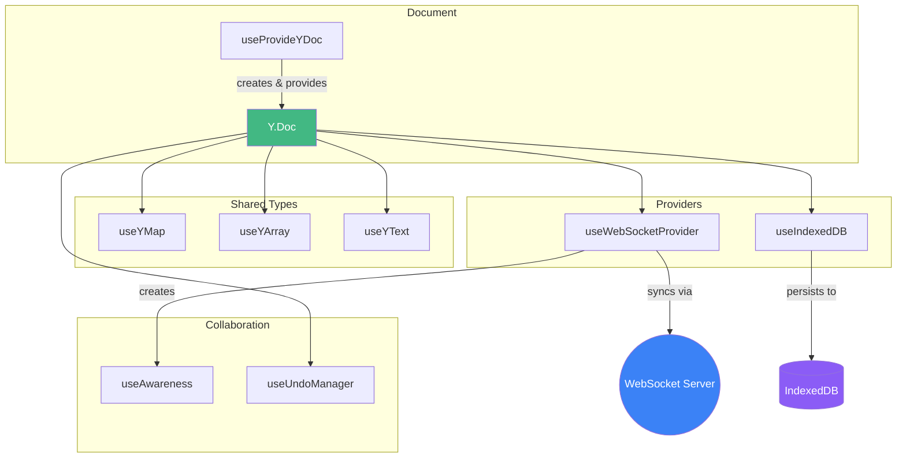
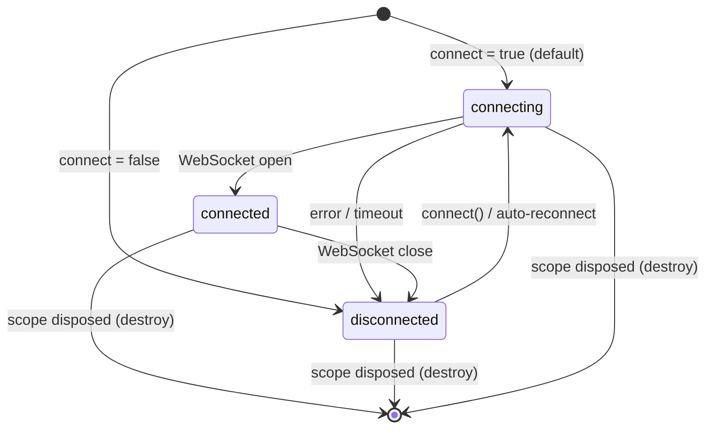
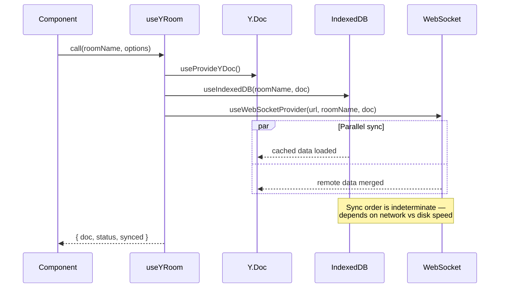

# Enhance Docs with Mermaid Diagrams and Docus UI Components

## Overview

The vue-yjs Docus documentation site has 16 content pages but uses almost no Docus prose components and zero Mermaid diagrams. This plan adds Mermaid diagram support via a Nuxt Content module, creates 3 high-impact diagrams, and enhances all pages with Docus UI components (`::field-group`, `::collapsible`, `::callout`, `::steps`, `::card-group`) to make the docs visually richer and easier to scan.

## Problem Statement / Motivation

Current state of the docs:
- **0 Mermaid diagrams** — the composable relationships, data flow, and provider state machines are only described in prose
- **12 composable API pages** use plain markdown tables and code fences with zero Docus UI components
- Only the landing page and installation page use any MDC components (`::card-group`, `::code-group`, `::u-page-hero`)
- TypeScript type declarations are always fully expanded inline, even when 20+ lines long
- The Quick Start page uses manual `## 1.` / `## 2.` headings instead of the `::steps` component
- No callouts, tips, or warnings highlight important caveats (like shallowRef requirements)

This makes the docs look plain and harder to scan compared to peers like VueUse, Nuxt UI, or Pinia docs.

## Proposed Solution

Three work streams, executed in phases:

1. **Mermaid support** — install `@barzhsieh/nuxt-content-mermaid`, configure dark/light theme switching, add 3 diagrams
2. **Composable page enhancements** — replace markdown tables with `::field-group`, wrap long type declarations in `::collapsible`, add contextual callouts
3. **Getting-started page enhancements** — convert Quick Start to `::steps`, add `::card-group` for shared types on Concepts page

## Technical Considerations

### Mermaid Module Compatibility

Mermaid is **not built into Docus v5**. The recommended module is `@barzhsieh/nuxt-content-mermaid` which hooks into Nuxt Content v3 markdown transformers. Key risks:
- The docs site uses `nuxt dev --extends docus` pattern — module must be compatible
- Nuxt 4 compatibility is unconfirmed — requires a spike before full implementation
- Mermaid.js is ~2.5MB — lazy loading (`lazy: true`) is essential for performance

**Spike first**: Install module, add one test diagram, verify it renders in both `pnpm dev` (with `--extends docus`) and `pnpm --filter vue-yjs-docs generate`.

### MDC Field Type Escaping

The `::field{type="..."}` attribute may struggle with complex TypeScript types containing angle brackets (e.g., `Readonly<ShallowRef<boolean>>`). MDC could interpret `<ShallowRef<boolean>>` as HTML. Need to test before converting all 12 pages.

**If angle brackets break**, use this fallback pattern — omit the `type` attribute and put the type in the description:

```md
::field{name="status" required}
`Readonly<ShallowRef<WebSocketProviderStatus>>` — Reactive connection status.
::
```

This keeps the `::field` component for visual structure while avoiding the parsing issue.

### SSG Behavior

Mermaid diagrams render client-side only during `nuxt generate` — static HTML will contain unrendered blocks until hydration. The module's lazy loading via IntersectionObserver handles this gracefully.

## Acceptance Criteria

### Phase 1: Mermaid Module Setup
- [ ] Install `@barzhsieh/nuxt-content-mermaid` in `docs/package.json`
- [ ] Configure module in `docs/nuxt.config.ts` with dark/light theme and lazy loading
- [ ] Verify Mermaid renders correctly in dev server (`pnpm dev` with `--extends docus`)
- [ ] Verify Mermaid renders correctly in SSG build (`pnpm --filter vue-yjs-docs generate`)
- [ ] Test `::field{type="Readonly<ShallowRef<boolean>>"}` escaping — determine strategy

### Phase 2: Mermaid Diagrams (3 pages)
- [ ] **Concepts page** (`content/1.getting-started/3.concepts.md`) — architecture flowchart:



- [ ] **useWebSocketProvider page** (`content/2.composables/3.providers/1.use-web-socket-provider.md`) — state machine diagram:



- [ ] **useYRoom page** (`content/2.composables/1.core/4.use-y-room.md`) — sequence diagram:



### Phase 3: Composable API Page Enhancements (12 pages)

Apply these transformations to all composable pages:

#### 3a. Replace markdown tables with `::field-group` / `::field`

Convert Parameters, Options, and Return Value tables. Example for useWebSocketProvider Parameters:

**Before:**
```md
| Name | Type | Required | Description |
|------|------|----------|-------------|
| `serverUrl` | `string` | Yes | WebSocket server URL. |
```

**After:**
```md
::field-group
  ::field{name="serverUrl" type="string" required}
  WebSocket server URL (e.g. `wss://example.com`).
  ::

  ::field{name="roomName" type="string" required}
  Room / document identifier.
  ::
::
```

**Pages affected:** All 12 composable pages (`useProvideYDoc`, `useYDoc`, `useY`, `useYRoom`, `useYMap`, `useYArray`, `useYText`, `useWebSocketProvider`, `useIndexedDB`, `useAwareness`, `useUndoManager`, `toYType`)

#### 3b. Wrap long type declarations in `::collapsible`

Threshold: type declaration code blocks with **10+ lines** get wrapped.

| Page | Lines | Collapsible? |
|------|-------|:------------:|
| useProvideYDoc | 1 | No |
| useYDoc | 5 | No |
| useY | 17 | Yes |
| useYRoom | 24 | Yes |
| useYMap | 12 | Yes |
| useYArray | 11 | Yes |
| useYText | 10 | Yes |
| useWebSocketProvider | 28 | Yes |
| useIndexedDB | 18 | Yes |
| useAwareness | 11 | Yes |
| useUndoManager | 17 | Yes |
| toYType | 1 | No |

Syntax:
```md
## Type Declarations

::collapsible{label="Show type declarations"}
```ts
// full declarations here
```
::
```

#### 3c. Add contextual callouts (sparingly — max 1-2 per page)

The callout text below is drafted from existing docs and source code. **Verify each claim against the actual composable implementation** before committing — these are content, not just markup.

| Page | Callout Type | Content |
|------|:------------|---------|
| `useProvideYDoc` | `::tip` | Auto-created docs are destroyed on scope dispose. Externally-provided docs are NOT destroyed — the caller manages their lifecycle. |
| `useYDoc` | `::warning` | Throws an error if no `Y.Doc` was provided by an ancestor component via `useProvideYDoc`. |
| `useY` | `::note` | This is a low-level composable. Prefer `useYMap`, `useYArray`, or `useYText` for typed access. |
| `useYRoom` | `::tip` | Combines `useProvideYDoc` + `useWebSocketProvider` + `useIndexedDB` into a single call. Ideal for most applications. |
| `useYMap` | `::tip` | Pass `defaults` in options to initialize keys that don't exist yet. Defaults are only applied once per key. |
| `useYArray` | `::warning` | The `update` callback in array items only works when items are `Y.Map` instances. Primitive values cannot be updated in-place. |
| `useYText` | `::note` | For rich text editing, consider using Yjs bindings for editors like TipTap or ProseMirror instead of this composable. |
| `useWebSocketProvider` | `::tip` | The provider automatically reconnects with exponential backoff (configurable via `maxBackoffTime`). |
| `useIndexedDB` | `::warning` | IndexedDB may be unavailable in private/incognito browsing mode in some browsers. |
| `useAwareness` | `::note` | Awareness state is ephemeral — it's NOT persisted or conflict-resolved like shared types. Use it for cursors, presence, and selections. |
| `useUndoManager` | `::tip` | Set `captureTimeout` to group rapid changes into a single undo step (e.g., keystrokes while typing). |
| `toYType` | `::note` | Usually not needed directly — composables like `useYMap` handle type conversion internally. |

### Phase 4: Getting-Started Page Enhancements

- [ ] **Quick Start** (`content/1.getting-started/2.quick-start.md`): Wrap the existing 3 steps in a `::steps` component. The current `## 1. Provide a Y.Doc` headings become `### Provide a Y.Doc` (H3) so the steps component renders them as numbered steps. The "How it works" and "Next steps" sections remain outside the `::steps` block as regular H2 sections.

```md
::steps{level="3"}

### Provide a Y.Doc
...existing content...

### Use shared types in child components
...existing content...

### Add networking (optional)
...existing content...

::

## How it works
...unchanged...
```

- [ ] **Concepts** (`content/1.getting-started/3.concepts.md`): Replace the Shared Types markdown table with `::card-group`. The current table has 4 rows including `Y.XmlFragment` — keep only the 3 types that have dedicated composables (Map, Array, Text) as cards, and add a brief note below for XmlFragment/generic `useY`:

```md
::::card-group
:::card
---
title: "Y.Map → useYMap"
icon: i-lucide-braces
to: /composables/shared-types/use-y-map
---
Object / Map equivalent. Reactive key-value store for structured data.
:::

:::card
---
title: "Y.Array → useYArray"
icon: i-lucide-list
to: /composables/shared-types/use-y-array
---
Array equivalent. Reactive ordered collection with push, delete, and update.
:::

:::card
---
title: "Y.Text → useYText"
icon: i-lucide-type
to: /composables/shared-types/use-y-text
---
String equivalent. Collaborative text with insert, delete, and format.
:::
::::

For other types like `Y.XmlFragment`, use the generic [`useY`](/composables/core/use-y) composable.
```

- [ ] **Concepts**: Add a `::warning` callout to the "Why shallowRef?" section:

```md
::warning
Never use `ref()` or `reactive()` to wrap Yjs data. All vue-yjs composables use `shallowRef` internally — destructuring `.value` will lose reactivity.
::
```

## Page-by-Page Summary

| Page | Mermaid | field-group | collapsible | callout | steps/cards |
|------|:-------:|:-----------:|:-----------:|:-------:|:-----------:|
| Installation | — | — | — | — | — |
| Quick Start | — | — | — | — | `::steps` |
| Concepts | Architecture flowchart | — | — | `::warning` | `::card-group` |
| useProvideYDoc | — | Yes | — | `::tip` | — |
| useYDoc | — | Yes | — | `::warning` | — |
| useY | — | Yes | Yes | `::note` | — |
| useYRoom | Sequence diagram | Yes | Yes | `::tip` | — |
| useYMap | — | Yes | Yes | `::tip` | — |
| useYArray | — | Yes | Yes | `::warning` | — |
| useYText | — | Yes | Yes | `::note` | — |
| useWebSocketProvider | State machine | Yes | Yes | `::tip` | — |
| useIndexedDB | — | Yes | Yes | `::warning` | — |
| useAwareness | — | Yes | Yes | `::note` | — |
| useUndoManager | — | Yes | Yes | `::tip` | — |
| toYType | — | Yes | — | `::note` | — |

## Dependencies & Risks

| Risk | Impact | Mitigation |
|------|--------|------------|
| Mermaid module incompatible with Docus v5 `--extends` or Nuxt 4 | Blocks all Mermaid work | Spike in Phase 1 before any diagram authoring. Fallback: custom `Mermaid.vue` component in `docs/app/components/content/` |
| Angle brackets in `::field{type="..."}` break MDC parsing | Breaks all field-group conversions | Test in Phase 1 spike. Fallback: use description slot for complex types instead of `type` attribute |
| Mermaid bundle size (~2.5MB) hurts page load | Slow docs pages | Enable `lazy: true` in module config, only 3 of 16 pages load it |
| Diagrams overflow on mobile | Poor mobile UX | Add `overflow-x: auto` wrapper via CSS |
| CI doesn't catch broken Mermaid rendering | Silent failures | Optionally add a smoke check that generated HTML contains SVG or mermaid container |

## Success Metrics

- All 12 composable pages use `::field-group` instead of plain markdown tables
- 3 Mermaid diagrams render correctly in both dev and SSG builds
- Type declarations on 9 pages are collapsible
- Each composable page has 1 contextual callout
- Quick Start uses `::steps` component
- Concepts page has `::card-group` for shared types
- No regressions in existing deployment pipeline (`build-docs` CI job passes)

## References & Research

### Internal References
- Existing docs site plan: `dev-docs/plans/2026-03-02-feat-docus-documentation-site-plan.md`
- Nuxt config: `docs/nuxt.config.ts`
- Custom components: `docs/app/components/content/YjsDemo.vue`, `SplitPane.vue`

### External References
- [Docus Components Documentation](https://docus.dev/en/essentials/components)
- [Docus Code Blocks](https://docus.dev/en/essentials/code-blocks)
- [@barzhsieh/nuxt-content-mermaid (npm)](https://www.npmjs.com/package/@barzhsieh/nuxt-content-mermaid)
- [Nuxt Content MDC Syntax](https://content.nuxt.com/docs/files/markdown)
- [Mermaid.js Syntax Reference](https://mermaid.js.org/)
