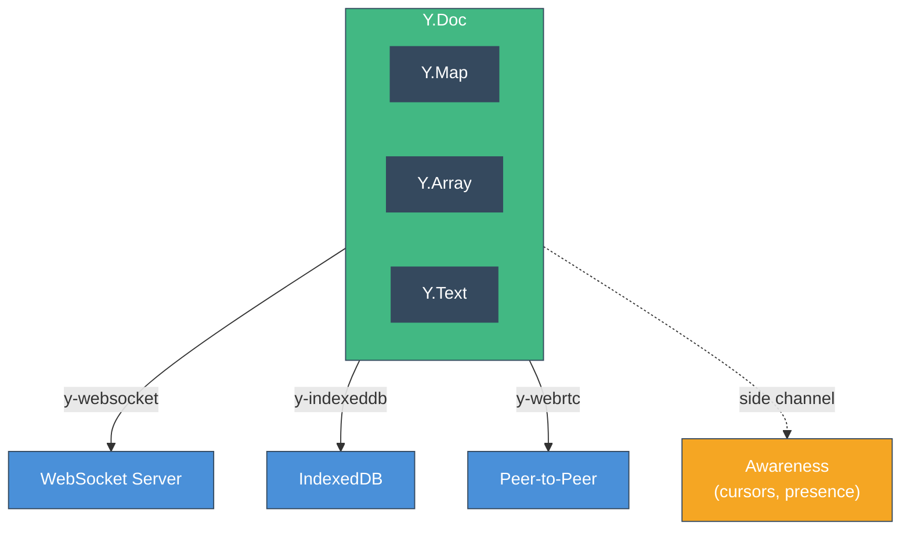

# Concepts

A brief introduction to Yjs concepts, explained through the lens of Vue's reactivity system.

::callout{icon="i-heroicons-book-open" color="primary"}
**Want to go deeper?** The [Guide](/guide/what-are-crdts) section covers CRDTs, the Yjs architecture, data model, and networking in detail.
::



## Y.Doc

A `Y.Doc` is the root container for all shared data. Think of it as a reactive store that can sync across clients. Every shared type lives inside a doc.

```ts
import * as Y from 'yjs'

const doc = new Y.Doc()
const yMap = doc.getMap('settings')    // named shared type
const yArray = doc.getArray('todos')   // another named shared type
```

In vue-yjs, you rarely create docs directly. Instead, use `useProvideYDoc()` which also handles cleanup:

```ts
const doc = useProvideYDoc() // auto-destroyed on scope dispose
```

## Shared Types

Yjs provides CRDT-backed data structures that merge concurrent edits automatically:

::card-group
  ::card{title="Y.Map" icon="i-heroicons-map"}
  Like an `Object` or `Map` — key-value pairs. Use with [`useYMap`](/composables/shared-types/use-y-map).
  ::
  ::card{title="Y.Array" icon="i-heroicons-queue-list"}
  Like an `Array` — ordered items. Use with [`useYArray`](/composables/shared-types/use-y-array).
  ::
  ::card{title="Y.Text" icon="i-heroicons-document-text"}
  Like a `String` — character-by-character editing. Use with [`useYText`](/composables/shared-types/use-y-text).
  ::
::

`Y.XmlFragment` (DOM trees) is also supported via the generic [`useY`](/composables/core/use-y) composable.

Each type supports nested structures. A `Y.Array` can contain `Y.Map` items, which can contain nested `Y.Array`s, etc.

## Providers

Providers connect a `Y.Doc` to the outside world. They handle syncing and persistence:

- **`y-websocket`** -- Syncs via WebSocket (wrapped by `useWebSocketProvider`)
- **`y-indexeddb`** -- Persists to browser storage (wrapped by `useIndexedDB`)
- **`y-webrtc`** -- Peer-to-peer sync (use with `useY` directly)

Multiple providers can be attached to the same doc simultaneously. For example, WebSocket for real-time sync + IndexedDB for offline persistence.

## Awareness

The awareness protocol is a lightweight channel for ephemeral state -- data that doesn't need to be persisted or conflict-resolved:

- Cursor positions
- User names and colors
- Selection ranges
- Online/offline status

```ts
const { states, setLocalStateField } = useAwareness<Cursor>(awareness)
setLocalStateField('name', 'Alice')
```

Awareness state is automatically removed when a client disconnects.

## Why shallowRef?

vue-yjs uses `shallowRef` (never `ref` or `reactive`) for all reactive state. Here's why:

::warning
Never use `ref()` or `reactive()` to wrap Yjs data. This will create deep proxies that conflict with Yjs's internal mutation tracking and cause subtle bugs.
::

1. **No wasted proxying** -- `ref()` would deep-proxy the JSON output, but we replace `.value` on every Yjs change anyway
2. **Efficient updates** -- Changes are detected by comparing the new `toJSON()` output with the previous value using `equalityDeep`
3. **Vue's recommendation** -- Vue docs explicitly recommend `shallowRef` for "integration with external state management systems"

This means you should access properties directly from `.value`:

```ts
const { data } = useYMap<{ count: number }>('counter')

// Correct -- read from .value
console.log(data.value.count)

// Won't be reactive -- destructuring loses reactivity
const { count } = data.value
```
