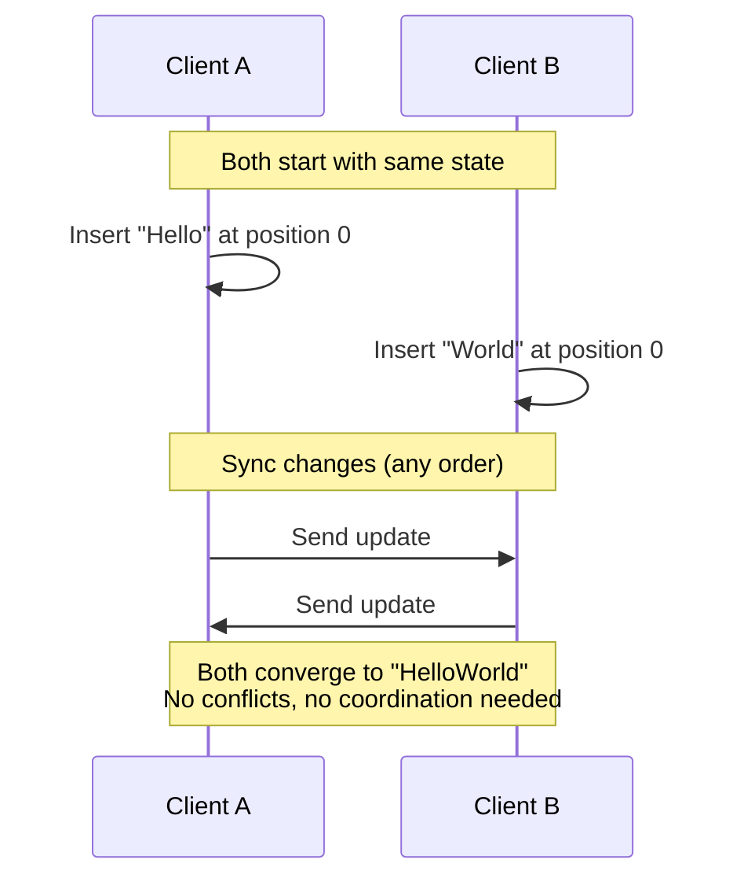

# What are CRDTs?

**Conflict-free Replicated Data Types** (CRDTs) are data structures designed for distributed systems where multiple users or devices need to modify shared data concurrently — without coordination and without conflicts.

## The Problem

Imagine two users editing the same document at the same time. User A adds "hello" while User B deletes a paragraph. Without a conflict resolution strategy, you have three bad options:

1. **Locking** — Only one user can edit at a time. Safe, but kills collaboration.
2. **Last-write-wins** — The last save overwrites everything. Fast, but loses data.
3. **Manual merge** — Show a diff and ask the user to resolve it (like git merge conflicts). Correct, but terrible UX for real-time apps.

CRDTs offer a fourth option: **automatic, mathematically guaranteed merge** with no data loss and no user intervention.

## How CRDTs Work

A CRDT is a data structure that is replicated across multiple computers in a network, with three key properties:

1. **Independent updates** — Any replica can be modified locally, without coordinating with others
2. **Automatic merge** — An algorithm resolves any inconsistencies when replicas sync
3. **Eventual consistency** — All replicas are guaranteed to converge to the same state, regardless of the order updates are applied

Think of it like git, but where every merge conflict is resolved automatically.

## Mathematical Properties

CRDTs guarantee convergence through three mathematical properties of their merge function:

| Property | Meaning | Why it matters |
|---|---|---|
| **Commutativity** | `merge(A, B) = merge(B, A)` | Order of receiving updates doesn't matter |
| **Associativity** | `merge(A, merge(B, C)) = merge(merge(A, B), C)` | Grouping of merges doesn't matter |
| **Idempotency** | `merge(A, A) = A` | Applying the same update twice is harmless |

These properties mean you can sync updates over unreliable networks, receive duplicates, process them in any order — and still converge to the correct result.

## Two Types of CRDTs

### State-based CRDTs (CvRDTs)

State-based CRDTs send their **entire state** to other replicas. The receiving replica merges the incoming state with its own using a merge function.

- **Pros**: Simple to implement, tolerant of message loss (just resend the full state)
- **Cons**: Larger payloads, especially for big data structures
- **Example**: A grow-only set (G-Set) where merge is just a set union

### Operation-based CRDTs (CmRDTs)

Operation-based CRDTs send only the **operations** (changes) to other replicas. Each replica applies the received operations to its local state.

- **Pros**: Smaller messages, more efficient for frequent updates
- **Cons**: Requires reliable, exactly-once delivery (or causal ordering)
- **Example**: A counter where each increment/decrement operation is broadcast

::callout{icon="i-heroicons-light-bulb" color="primary"}
**Yjs uses a hybrid approach.** It encodes operations for efficiency but can also exchange full state snapshots for initial sync. This gives you the best of both worlds.
::

## Common CRDT Data Structures

CRDTs exist for many familiar data types:

| CRDT | Description | Analogous to |
|---|---|---|
| **G-Counter** | Increment-only counter | `number` (add only) |
| **PN-Counter** | Increment and decrement counter | `number` |
| **G-Set** | Add-only set | `Set` (add only) |
| **OR-Set** | Add and remove set (observed-remove) | `Set` |
| **LWW-Register** | Last-writer-wins single value | Variable assignment |
| **Sequence CRDT** | Ordered list with concurrent insert/delete | `Array` / `String` |

Yjs implements **sequence CRDTs** using the [YATA algorithm](https://www.researchgate.net/publication/310212186_Near_Real-Time_Peer-to-Peer_Shared_Editing_on_Extensible_Data_Types) (Yet Another Transformation Approach), which is optimized for text editing and ordered collections.

## Real-World Applications

CRDTs power many tools you may already use:

- **Apple Notes** — Syncs offline edits between iPhone, iPad, and Mac
- **Figma** — Real-time collaborative design (uses a CRDT-inspired approach)
- **Redis** — Active-active geo-distributed databases with CRDT support
- **Linear** — Issue tracker with offline-first architecture
- **Automerge / Yjs** — Open-source CRDT libraries for building your own collaborative apps

## CRDTs vs. Operational Transform (OT)

You might have heard of OT, the algorithm behind Google Docs. Here's how they compare:

| | CRDTs | Operational Transform |
|---|---|---|
| **Architecture** | Decentralized (peer-to-peer capable) | Centralized (requires a server) |
| **Offline support** | Built-in — merge when reconnected | Limited — requires server mediation |
| **Correctness** | Mathematically proven convergence | Requires careful transform functions |
| **Complexity** | Simpler algorithm, larger state | Complex transforms, smaller state |
| **Adoption** | Yjs, Automerge, Diamond Types | Google Docs, SharePoint |

::callout{icon="i-heroicons-arrow-right" color="primary"}
**Next**: Learn how Yjs implements these concepts in [How Yjs Works](/guide/how-yjs-works).
::
