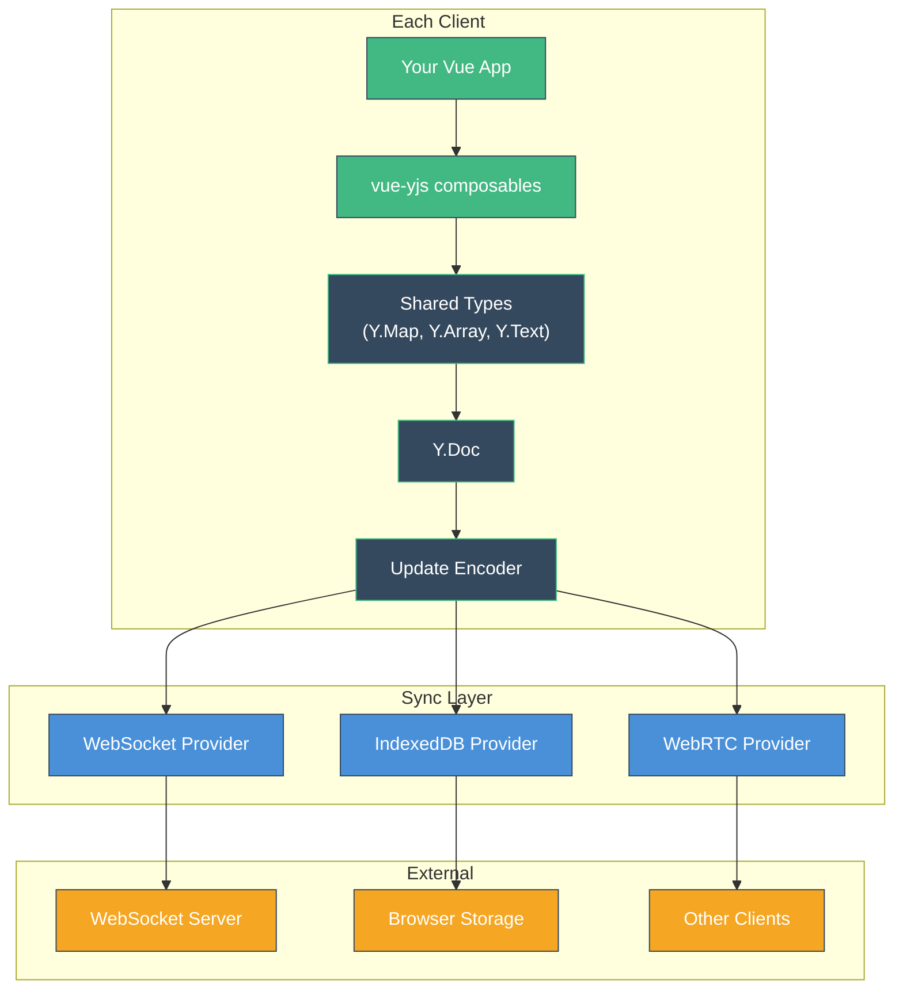
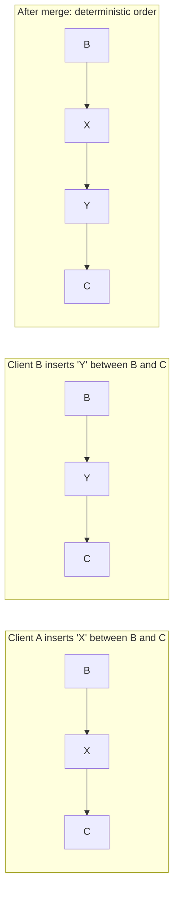
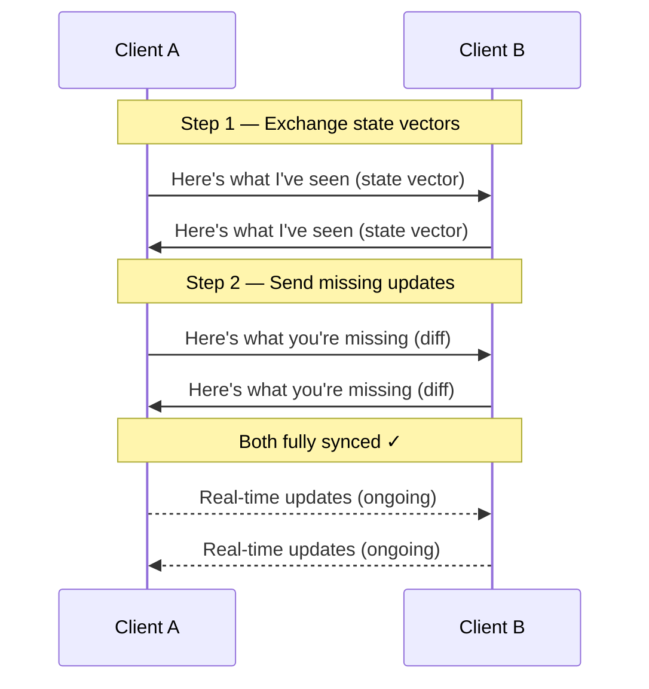

# How Yjs Works

Yjs is a high-performance CRDT implementation for JavaScript. It exposes familiar data structures — maps, arrays, and text — that automatically sync across clients without merge conflicts.

## Architecture Overview



At a high level:

1. Your app manipulates **shared types** through vue-yjs composables
2. Shared types live inside a **Y.Doc** — the root container for all collaborative state
3. Changes are encoded as **updates** — compact binary representations
4. **Providers** transport updates to other clients, servers, or storage

## Y.Doc — The Root Container

A `Y.Doc` is the central data structure in Yjs. It holds all shared types and manages the CRDT state.

```ts
import * as Y from 'yjs'

const doc = new Y.Doc()

// Get or create named shared types
const settings = doc.getMap('settings')       // Y.Map
const todos = doc.getArray('todos')           // Y.Array
const content = doc.getText('editor-content') // Y.Text
```

Key characteristics:

- **Named top-level types** — Each shared type is identified by a string name. Calling `doc.getMap('settings')` on any client returns the same shared map.
- **Single document, multiple types** — One Y.Doc can hold many shared types of different kinds.
- **Client ID** — Each doc has a unique `clientID` used to attribute operations. This is assigned automatically.

### State Vector

The Y.Doc maintains a **state vector** — a compact representation of which operations it has seen from each client. This is used during sync to determine what updates a peer is missing.

```ts
// Get the state vector (what this doc has seen)
const stateVector = Y.encodeStateVector(doc)

// Get only the updates missing from a given state vector
const diff = Y.encodeStateAsUpdate(doc, remoteStateVector)
```

## The YATA Algorithm

Yjs uses the **YATA** (Yet Another Transformation Approach) algorithm for its sequence types (Y.Array, Y.Text). YATA is a list CRDT where:

1. Every inserted item gets a **unique ID** — a `(clientID, clock)` tuple
2. Each item stores references to its **left** and **right** neighbors at the time of insertion
3. When concurrent inserts target the same position, a **deterministic ordering rule** breaks the tie (using client IDs)



This means:
- Inserts never conflict — concurrent inserts at the same position get a defined order
- Deletes are handled by **tombstoning** — deleted items are marked but kept in the structure to preserve ordering context
- The algorithm is proven to maintain **intention preservation** — your insert stays where you intended, relative to its neighbors

## Updates and Encoding

Every change to a Y.Doc produces an **update** — a compact binary Uint8Array:

```ts
// Listen for updates
doc.on('update', (update: Uint8Array) => {
  // `update` contains just the new changes
  // Send this to other clients via any transport
})

// Apply a received update
Y.applyUpdate(doc, receivedUpdate)
```

Updates have important properties:

- **Order-independent** — Updates can be applied in any order and the result is the same
- **Idempotent** — Applying the same update twice has no effect
- **Compact** — Binary encoding is highly optimized for size
- **Composable** — Multiple updates can be merged into a single update

```ts
// Merge multiple updates into one
const mergedUpdate = Y.mergeUpdates([update1, update2, update3])
```

## The Sync Protocol

When two clients connect, they sync using a simple two-step protocol:



After the initial sync, clients exchange updates in real-time as they happen. Because updates are order-independent and idempotent, the protocol is resilient to network issues — lost messages can simply be re-sent.

## Transactions

Changes to shared types are grouped into **transactions**. Yjs creates implicit transactions for each operation, but you can group multiple operations for efficiency:

```ts
doc.transact(() => {
  ymap.set('name', 'Alice')
  ymap.set('color', '#42b883')
  yarray.push(['new item'])
})
// Observers fire once, after the transaction
// Only one update is generated for the whole batch
```

Transactions:
- **Batch observer notifications** — Instead of firing for each individual change
- **Produce a single update** — More efficient for network transport
- **Are atomic** — All changes in a transaction are applied together

## Garbage Collection

Deleted items in Yjs are initially kept as tombstones (needed for correct CRDT merging). Over time, Yjs can garbage-collect tombstones that are no longer needed:

- `doc.gc = true` (default) — Enables automatic garbage collection
- Tombstones are collected when all clients have seen the deletion
- This keeps document size from growing unboundedly

## Performance

Yjs is [benchmarked](https://github.com/dmonad/crdt-benchmarks) as the fastest CRDT implementation available:

- Document updates are encoded in a highly optimized binary format
- The internal data structure uses a linked list with skip-list indexing for O(log n) access
- Memory usage is proportional to the current document size, not the full history

::callout{icon="i-heroicons-arrow-right" color="primary"}
**Next**: Learn about the data model in detail in [Yjs Data Model](/guide/yjs-data-model).
::
