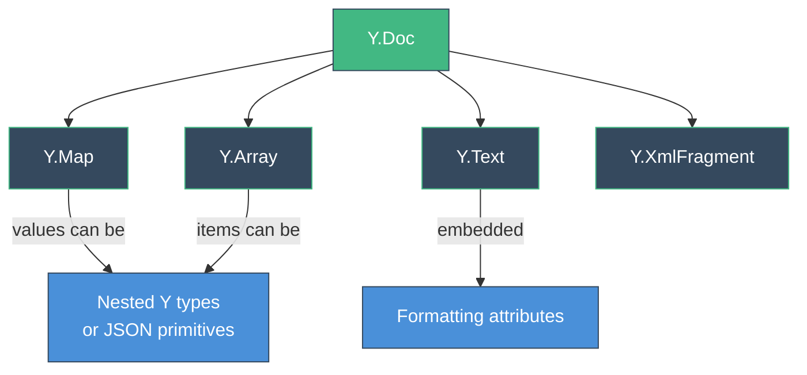

# Yjs Data Model

Yjs shared types are the building blocks of collaborative state. They look and feel like standard JavaScript data structures, but changes are automatically merged across all connected clients.

## Shared Type Hierarchy



## Y.Map

A shared key-value store, similar to a JavaScript `Map` or plain object.

### Operations

```ts
const ymap = doc.getMap('settings')

// Set values
ymap.set('theme', 'dark')
ymap.set('fontSize', 14)
ymap.set('user', { name: 'Alice', role: 'admin' }) // JSON value

// Get values
ymap.get('theme')      // 'dark'
ymap.get('fontSize')   // 14

// Delete
ymap.delete('fontSize')

// Check existence
ymap.has('theme')      // true

// Iterate
ymap.forEach((value, key) => {
  console.log(key, value)
})

// Convert to plain object
ymap.toJSON()          // { theme: 'dark', user: { name: 'Alice', role: 'admin' } }
```

### Conflict Resolution

When two clients set the same key concurrently, **both values are preserved internally**, but only one is visible. The winning value is determined deterministically (by client ID), so all clients agree on the same result.

::callout{icon="i-heroicons-information-circle"}
For simple key-value data, this "last-writer-wins per key" behavior is usually what you want. For more granular conflict resolution, use nested Y types instead of JSON objects as values.
::

### With vue-yjs

```ts
const { data, set, deleteProperty } = useYMap<{ theme: string; fontSize: number }>('settings')

// data.value is a readonly reactive snapshot
console.log(data.value.theme)    // reactive!

// Mutate via set/delete
set('theme', 'light')
deleteProperty('fontSize')
```

## Y.Array

A shared ordered list, similar to a JavaScript `Array`.

### Operations

```ts
const yarray = doc.getArray('todos')

// Insert items
yarray.push(['Buy milk'])               // append
yarray.unshift(['First item'])           // prepend
yarray.insert(1, ['Middle item'])        // insert at index

// Access items
yarray.get(0)                            // 'First item'
yarray.length                            // 3
yarray.toArray()                         // ['First item', 'Middle item', 'Buy milk']

// Delete items
yarray.delete(1, 1)                      // delete 1 item at index 1

// Iterate
yarray.forEach((item, index) => {
  console.log(index, item)
})

// Convert to JSON
yarray.toJSON()                          // ['First item', 'Buy milk']
```

### Conflict Resolution

Concurrent inserts at the same index are both preserved — they get a deterministic order based on the YATA algorithm. No items are ever silently dropped.

```
Client A: insert "X" at index 2
Client B: insert "Y" at index 2
Result:   [..., "X", "Y", ...]   (deterministic order)
```

### With vue-yjs

```ts
const { data, push, deleteElement } = useYArray<string>('todos')

// data.value is a reactive array snapshot
data.value.forEach(todo => console.log(todo))

// Mutate via helpers
push('New todo')
deleteElement(0, 1)
```

## Y.Text

A shared text type optimized for character-by-character collaborative editing. Supports rich-text formatting via attributes.

### Operations

```ts
const ytext = doc.getText('content')

// Insert text
ytext.insert(0, 'Hello ')
ytext.insert(6, 'World!')

// Delete text
ytext.delete(5, 1)                       // delete 1 char at position 5

// Get content
ytext.toString()                         // 'HelloWorld!'
ytext.length                             // 11

// Rich text formatting
ytext.insert(0, 'Bold text', { bold: true })
ytext.format(0, 4, { italic: true })     // make first 4 chars italic

// Get formatted content as delta
ytext.toDelta()
// [
//   { insert: 'Bold', attributes: { bold: true, italic: true } },
//   { insert: ' text', attributes: { bold: true } },
//   { insert: 'HelloWorld!' }
// ]
```

### Conflict Resolution

Y.Text uses the YATA sequence CRDT for character-level merging. Two users typing at the same position will have their characters interleaved deterministically. Two users typing in different parts of the text won't affect each other at all.

### With vue-yjs

```ts
const { data } = useYText('content')

// data.value is the string content, reactively updated
console.log(data.value) // 'HelloWorld!'
```

## Y.XmlFragment

A shared XML/DOM tree structure. Primarily used by editor bindings (ProseMirror, TipTap, etc.) to represent document structure.

```ts
const xml = doc.getXmlFragment('prosemirror')

// Typically used via editor bindings, not directly
// Use the generic useY() composable for reactive access
```

### With vue-yjs

```ts
import { useY } from 'vue-yjs'

const xml = doc.getXmlFragment('editor')
const data = useY(xml)
```

## Nested Types

Shared types can be nested inside each other. This is how you build complex collaborative data models:

```ts
const todos = doc.getArray('todos')

// Create a nested Y.Map for each todo item
const todo = new Y.Map()
todo.set('title', 'Buy groceries')
todo.set('completed', false)
todo.set('tags', new Y.Array()) // nested array inside the map

// Insert the map into the array
todos.push([todo])

// Modify nested data
const firstTodo = todos.get(0) as Y.Map<any>
firstTodo.set('completed', true)

// Access nested data
const tags = firstTodo.get('tags') as Y.Array<string>
tags.push(['urgent'])
```

::warning
**Important constraint:** A shared type instance can only exist in one location. You cannot insert the same Y.Map into two different arrays. Create a new instance if you need the same data in multiple places.
::

### Why Nested Types Matter

Using nested Y types instead of plain JSON objects gives you **granular conflict resolution**:

```ts
// Plain JSON — overwrites the entire object on conflict
ymap.set('user', { name: 'Alice', color: 'red' })

// vs. Nested Y.Map — each field merges independently
const user = new Y.Map()
user.set('name', 'Alice')
user.set('color', 'red')
ymap.set('user', user)

// Now Client A can change 'name' and Client B can change 'color'
// without either overwriting the other's change
```

## Observing Changes

Every shared type emits events when modified:

### observe — Direct Changes

```ts
ymap.observe(event => {
  event.keysChanged // Set of changed keys
  event.changes     // Detailed change information
})
```

### observeDeep — All Nested Changes

```ts
ymap.observeDeep(events => {
  // Fires for changes to the map AND any nested types
  events.forEach(event => {
    console.log(event.path)    // path from the observed type to the changed type
    console.log(event.changes) // what changed
  })
})
```

::callout{icon="i-heroicons-information-circle"}
**vue-yjs uses `observeDeep` internally.** When any nested value changes, the composable's reactive ref updates automatically. You don't need to set up observers manually.
::

## Transactions

Group multiple operations into a single transaction for efficiency:

```ts
doc.transact(() => {
  const todo = new Y.Map()
  todo.set('title', 'New task')
  todo.set('completed', false)
  todos.push([todo])
})
// One observer notification, one update event
```

Without a transaction, each `set` and `push` would trigger separate observer calls and generate separate updates.

## Converting to JSON

Every shared type supports `toJSON()` for serialization:

```ts
ymap.toJSON()   // { key: 'value', nested: { ... } }
yarray.toJSON() // ['item1', 'item2', { nested: 'map' }]
ytext.toJSON()  // 'plain text content'
```

::warning
**Don't modify the returned JSON.** Yjs doesn't clone the output for performance reasons. Mutating it can corrupt internal state. Always use the shared type's methods (`set`, `push`, `insert`, etc.) to make changes.
::

::callout{icon="i-heroicons-arrow-right" color="primary"}
**Next**: Learn about networking and offline support in [Providers & Networking](/guide/providers-and-networking).
::
