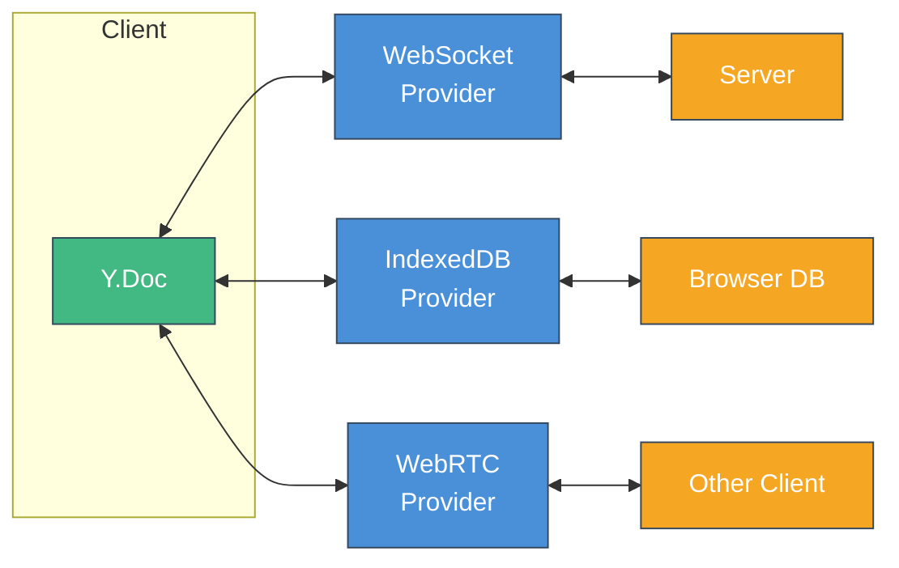
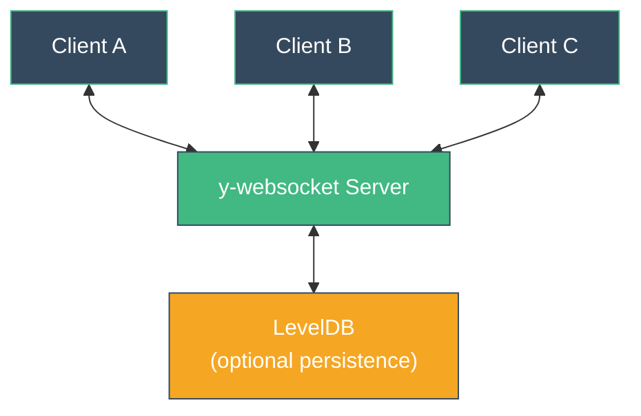
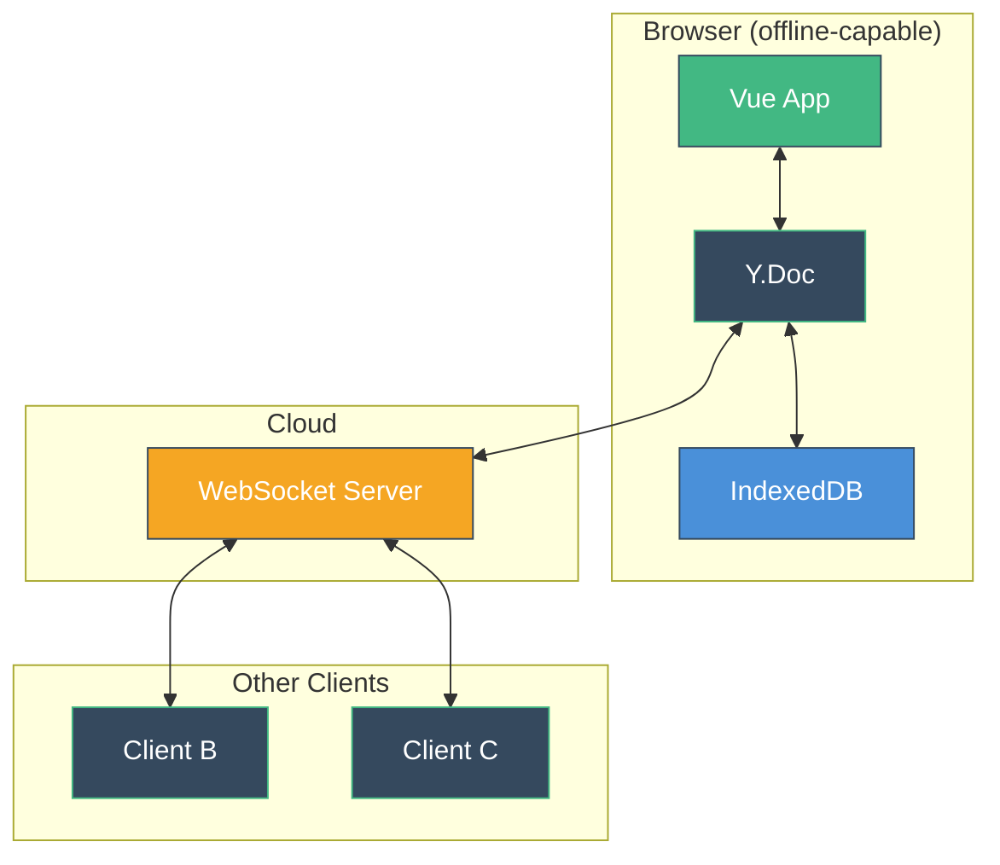
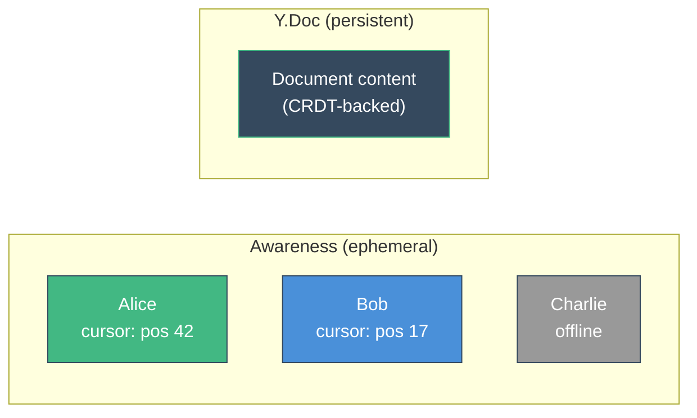
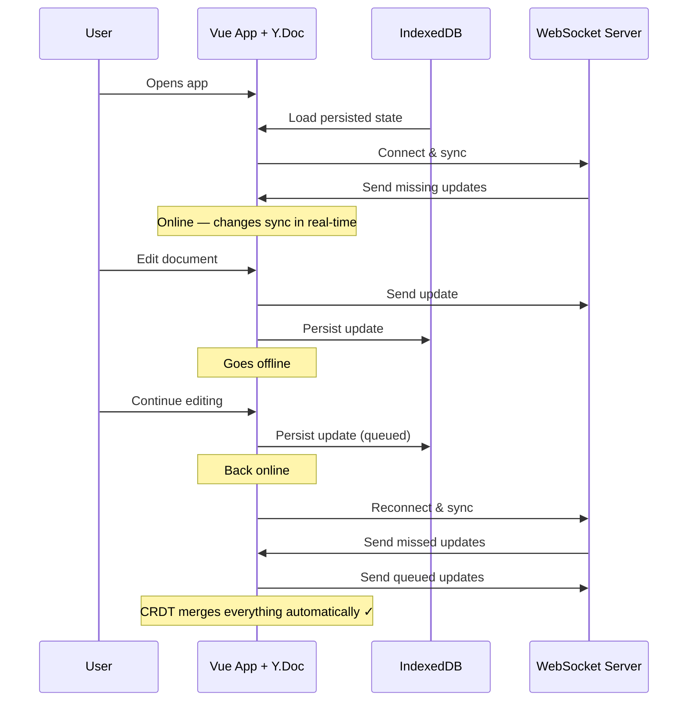

# Providers & Networking

Yjs is **network agnostic** — it doesn't assume any particular transport or server architecture. Instead, it uses a **provider** pattern to decouple the CRDT data model from how data is transported and stored.

## What is a Provider?

A provider connects a `Y.Doc` to the outside world. It listens for local updates and sends them somewhere — another client, a server, a database. It also receives remote updates and applies them to the local doc.



Multiple providers can be attached to the same Y.Doc simultaneously. This is how you get both real-time sync and offline persistence.

## WebSocket Provider (y-websocket)

The most common provider. Syncs changes through a WebSocket server that relays updates between clients.

```ts
import { WebsocketProvider } from 'y-websocket'

const wsProvider = new WebsocketProvider(
  'wss://your-server.com',
  'room-name',    // clients in the same room sync together
  doc
)

// Connection status
wsProvider.on('status', ({ status }) => {
  console.log(status) // 'connecting', 'connected', 'disconnected'
})

// Sync status
wsProvider.on('sync', (isSynced: boolean) => {
  console.log('Synced with server:', isSynced)
})
```

### With vue-yjs

```ts
const { status, synced } = useWebSocketProvider('wss://your-server.com', 'room-name')

// status.value — 'connecting' | 'connected' | 'disconnected'
// synced.value — true when initial sync is complete
```

### Server Architecture

The `y-websocket` server is a lightweight relay:



- **Rooms** — Clients join named rooms. Updates are broadcast to all clients in the same room.
- **No conflict resolution on the server** — The server just relays updates. CRDTs handle merging on each client.
- **Optional persistence** — The server can persist document state to LevelDB so documents survive server restarts.

You can also use the server as a simple npm package:

```bash
npx y-websocket
```

Or run it programmatically in your own server (as the Nuxt example in this project does).

## IndexedDB Provider (y-indexeddb)

Persists document state to the browser's IndexedDB. This enables **offline-first** workflows — users can close the tab, go offline, and pick up exactly where they left off.

```ts
import { IndexeddbPersistence } from 'y-indexeddb'

const idbProvider = new IndexeddbPersistence('doc-name', doc)

idbProvider.on('synced', () => {
  console.log('Loaded from IndexedDB')
})
```

### With vue-yjs

```ts
useIndexedDB('doc-name')
// That's it — persistence is now active for the provided Y.Doc
```

### How It Works

1. On first load, the provider creates an IndexedDB store for the document
2. Every update to the Y.Doc is persisted to IndexedDB
3. On subsequent loads, the stored state is loaded into the Y.Doc before WebSocket sync
4. When WebSocket sync completes, the doc has both local offline changes and remote changes — merged automatically by the CRDT

## WebRTC Provider (y-webrtc)

Peer-to-peer sync without a central server. Clients discover each other via a signaling server and then communicate directly.

```ts
import { WebrtcProvider } from 'y-webrtc'

const rtcProvider = new WebrtcProvider('room-name', doc, {
  signaling: ['wss://signaling.yjs.dev']
})
```

- **No server needed** for data relay (only signaling)
- **End-to-end encrypted** by default
- **Best for**: small groups, privacy-sensitive applications, or when you can't run a WebSocket server

## Combining Providers

The real power of Yjs providers is combining them:

```ts
// Real-time sync via WebSocket
const wsProvider = new WebsocketProvider('wss://server.com', 'room', doc)

// Offline persistence via IndexedDB
const idbProvider = new IndexeddbPersistence('room', doc)
```



### With vue-yjs (all-in-one)

The `useYRoom` composable combines doc creation, WebSocket, and IndexedDB in a single call:

```ts
const { doc, status, synced } = useYRoom({
  roomName: 'my-room',
  wsUrl: 'wss://server.com',
  indexedDB: true, // enable offline persistence
})
```

## Awareness Protocol

The **awareness protocol** is a separate communication channel for **ephemeral state** — data that doesn't need to be part of the CRDT:

- Cursor positions
- User presence (who's online)
- User names and colors
- Selection ranges
- Typing indicators



### Key Differences from CRDT State

| | CRDT (Y.Doc) | Awareness |
|---|---|---|
| **Persistence** | Persisted, synced to all clients | Ephemeral, lost on disconnect |
| **Conflict resolution** | CRDT merge (all changes preserved) | Last-write-wins per client |
| **Cleanup** | Manual delete required | Auto-removed on disconnect |
| **Use case** | Document content, app state | Cursors, presence, selections |

### With vue-yjs

```ts
const { states, setLocalStateField } = useAwareness<{
  name: string
  color: string
  cursor: { x: number; y: number }
}>(awareness)

// Set local user info
setLocalStateField('name', 'Alice')
setLocalStateField('color', '#42b883')
setLocalStateField('cursor', { x: 100, y: 200 })

// Read all connected users' states
states.value.forEach((state, clientId) => {
  console.log(`${state.name} is at ${state.cursor.x}, ${state.cursor.y}`)
})
```

## Offline-First Pattern

Combining CRDTs with providers gives you a robust offline-first architecture:



No special offline handling code is needed. The CRDT guarantees that all changes merge correctly, regardless of when they were made or in what order they arrive.

::callout{icon="i-heroicons-arrow-right" color="primary"}
**Ready to build?** Head to the [Getting Started guide](/getting-started/installation) to start using vue-yjs in your app.
::
