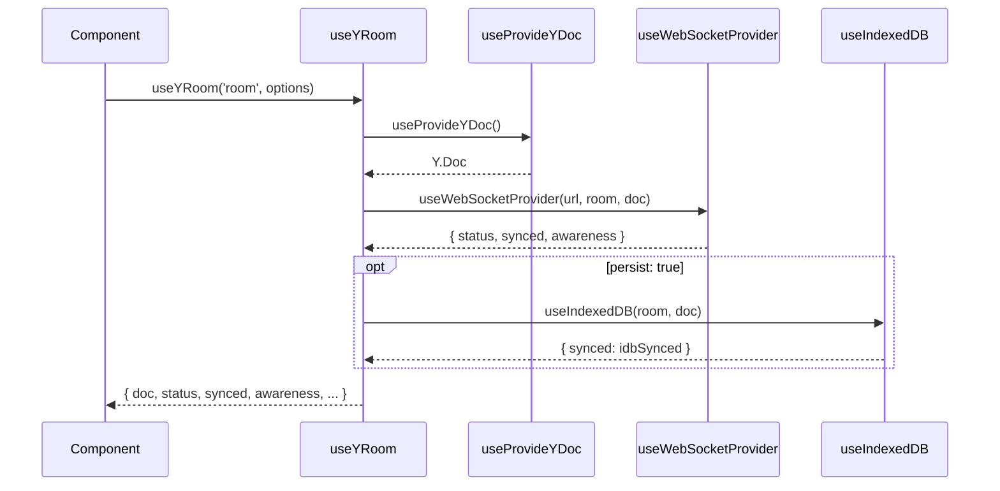

# useYRoom

All-in-one room setup: creates a `Y.Doc`, optionally persists it to IndexedDB, and connects via WebSocket. Combines `useProvideYDoc`, `useWebSocketProvider`, and optionally `useIndexedDB` into a single composable.

::tip
`useYRoom` is the recommended starting point for most apps. It handles doc creation, WebSocket sync, and optional IndexedDB persistence in a single call.
::

## Usage

```vue
<script setup lang="ts">
import { useYRoom } from 'vue-yjs'

const { doc, status, synced, awareness } = useYRoom('my-room', {
  serverUrl: 'wss://demos.yjs.dev/ws',
})
</script>

<template>
  <p>Status: {{ status }} | Synced: {{ synced }}</p>
</template>
```

With persistence:

```ts
const { doc, status, synced } = useYRoom('my-room', {
  serverUrl: 'wss://example.com',
  persist: true,
  persistPrefix: 'myapp-',
})
```

## Parameters

::field-group
  ::field{name="roomName" type="string" required}
  Room / document identifier.
  ::
  ::field{name="options" type="UseYRoomOptions" required}
  Room configuration (see Options below).
  ::
::

## Options

::field-group
  ::field{name="serverUrl" type="string" required}
  WebSocket server URL (e.g. `wss://example.com`).
  ::
  ::field{name="persist" type="boolean"}
  Whether to persist the document to IndexedDB. Default: `false`.
  ::
  ::field{name="persistPrefix" type="string"}
  Prefix for the IndexedDB database name. Full name is `${persistPrefix}${roomName}`. Default: `"yjs-"`.
  ::
  ::field{name="webSocket" type="UseWebSocketProviderOptions"}
  Additional options forwarded to `useWebSocketProvider`.
  ::
  ::field{name="onPersistError"}
  `(error: unknown) => void` — Error callback for IndexedDB failures. Default: `console.error`.
  ::
::

## Return Value

::field-group
  ::field{name="doc" type="Y.Doc"}
  The created and provided `Y.Doc`.
  ::
  ::field{name="provider" type="WebsocketProvider"}
  The underlying `WebsocketProvider` instance.
  ::
  ::field{name="status"}
  `Readonly<ShallowRef<WebSocketProviderStatus>>` — Reactive WebSocket connection status (`"connecting"` | `"connected"` | `"disconnected"`).
  ::
  ::field{name="synced"}
  `Readonly<ShallowRef<boolean>>` — Whether the initial sync with the server has completed.
  ::
  ::field{name="awareness" type="Awareness"}
  The awareness instance from the WebSocket provider.
  ::
  ::field{name="connect"}
  `() => void` — Open the WebSocket connection.
  ::
  ::field{name="disconnect"}
  `() => void` — Close the WebSocket connection.
  ::
::

## Type Declarations

::collapsible{label="Show type declarations"}
```ts
interface UseYRoomOptions {
  serverUrl: string
  persist?: boolean
  persistPrefix?: string
  webSocket?: UseWebSocketProviderOptions
  onPersistError?: (error: unknown) => void
}

interface UseYRoomReturn {
  doc: Y.Doc
  provider: WebsocketProvider
  status: Readonly<ShallowRef<WebSocketProviderStatus>>
  synced: Readonly<ShallowRef<boolean>>
  awareness: Awareness
  connect: () => void
  disconnect: () => void
}

declare function useYRoom(
  roomName: string,
  options: UseYRoomOptions,
): UseYRoomReturn
```
::

## Call Flow



## Related

- [useProvideYDoc](/composables/core/use-provide-y-doc) — Standalone doc provider
- [useWebSocketProvider](/composables/providers/use-web-socket-provider) — Standalone WebSocket provider
- [useIndexedDB](/composables/providers/use-indexed-db) — Standalone IndexedDB persistence
- [useAwareness](/composables/collaboration/use-awareness) — Use with the returned `awareness` instance
