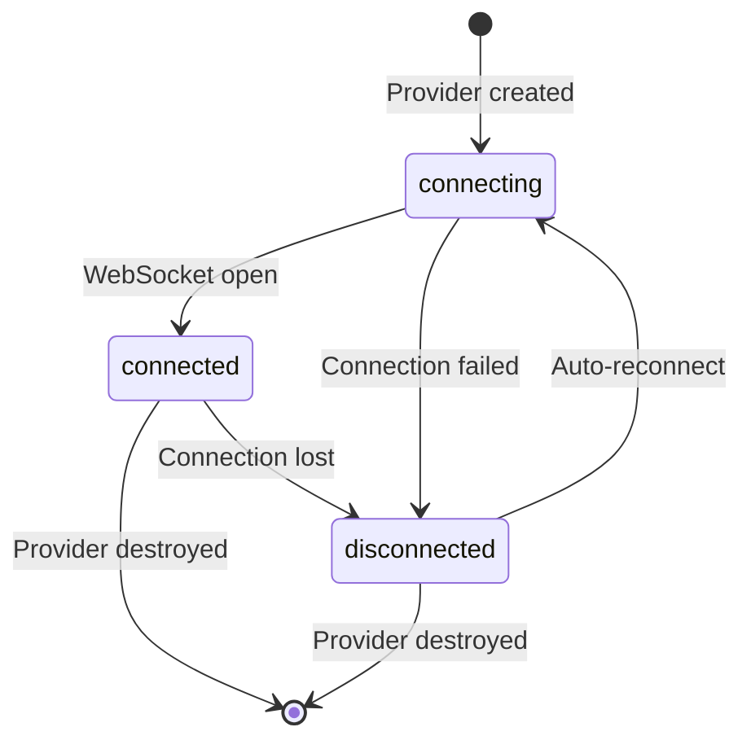

# useWebSocketProvider

Reactive wrapper around `y-websocket`'s `WebsocketProvider`. Creates a provider that syncs the given `Y.Doc` over WebSocket and exposes reactive `status` and `synced` refs. The provider is destroyed when the enclosing effect scope is disposed.

::tip
The provider automatically reconnects with exponential backoff when the connection drops. Use the `maxBackoffTime` option to control the maximum delay.
::

## Usage

```vue
<script setup lang="ts">
import { useProvideYDoc, useWebSocketProvider } from 'vue-yjs'

const doc = useProvideYDoc()
const { status, synced, awareness, connect, disconnect } =
  useWebSocketProvider('wss://demos.yjs.dev/ws', 'my-room', doc)
</script>

<template>
  <span>Status: {{ status }}</span>
  <span v-if="synced">Synced!</span>
  <button @click="disconnect">Disconnect</button>
</template>
```

## Parameters

::field-group
  ::field{name="serverUrl" type="string" required}
  WebSocket server URL (e.g. `wss://example.com`).
  ::
  ::field{name="roomName" type="string" required}
  Room / document identifier.
  ::
  ::field{name="doc" type="Y.Doc" required}
  The `Y.Doc` to synchronise.
  ::
  ::field{name="options" type="UseWebSocketProviderOptions"}
  Optional provider configuration (see Options below).
  ::
::

## Options

::field-group
  ::field{name="awareness" type="Awareness"}
  Existing awareness instance to use instead of creating one.
  ::
  ::field{name="connect" type="boolean"}
  Whether to connect immediately. Default: `true`.
  ::
  ::field{name="params"}
  `Record<string, string>` — Additional query parameters appended to the WebSocket URL.
  ::
  ::field{name="WebSocketPolyfill"}
  `typeof WebSocket` — WebSocket constructor override (useful for non-browser environments).
  ::
  ::field{name="resyncInterval" type="number"}
  Interval in milliseconds at which the provider re-syncs with the server. Default: `-1` (disabled).
  ::
  ::field{name="maxBackoffTime" type="number"}
  Maximum reconnection back-off time in milliseconds. Default: `2500`.
  ::
  ::field{name="disableBc" type="boolean"}
  Disable broadcast-channel cross-tab sync. Default: `false`.
  ::
::

## Return Value

::field-group
  ::field{name="provider" type="WebsocketProvider"}
  The underlying `WebsocketProvider` instance.
  ::
  ::field{name="awareness" type="Awareness"}
  The awareness instance used by the provider.
  ::
  ::field{name="status"}
  `Readonly<ShallowRef<WebSocketProviderStatus>>` — Reactive connection status: `"connecting"` | `"connected"` | `"disconnected"`.
  ::
  ::field{name="synced"}
  `Readonly<ShallowRef<boolean>>` — Whether the initial sync with the server has completed.
  ::
  ::field{name="connect"}
  `() => void` — Open the WebSocket connection.
  ::
  ::field{name="disconnect"}
  `() => void` — Close the WebSocket connection.
  ::
::

## Lifecycle

The provider is created immediately and destroyed on `onScopeDispose`. Event listeners for `status` and `sync` are also cleaned up automatically.

## Peer Dependencies

This composable requires `y-websocket`:

```bash
pnpm add y-websocket
```

## Type Declarations

::collapsible{label="Show type declarations"}
```ts
type WebSocketProviderStatus = "connecting" | "connected" | "disconnected"

interface UseWebSocketProviderOptions {
  awareness?: Awareness
  connect?: boolean
  params?: Record<string, string>
  WebSocketPolyfill?: typeof WebSocket
  resyncInterval?: number
  maxBackoffTime?: number
  disableBc?: boolean
}

interface UseWebSocketProviderReturn {
  provider: WebsocketProvider
  awareness: Awareness
  status: Readonly<ShallowRef<WebSocketProviderStatus>>
  synced: Readonly<ShallowRef<boolean>>
  connect: () => void
  disconnect: () => void
}

declare function useWebSocketProvider(
  serverUrl: string,
  roomName: string,
  doc: Y.Doc,
  options?: UseWebSocketProviderOptions,
): UseWebSocketProviderReturn
```
::

## Connection States



## Related

- [useYRoom](/composables/core/use-y-room) — All-in-one setup that combines this with useProvideYDoc and useIndexedDB
- [useAwareness](/composables/collaboration/use-awareness) — Reactive binding for the returned `awareness` instance
- [useIndexedDB](/composables/providers/use-indexed-db) — Offline persistence companion
